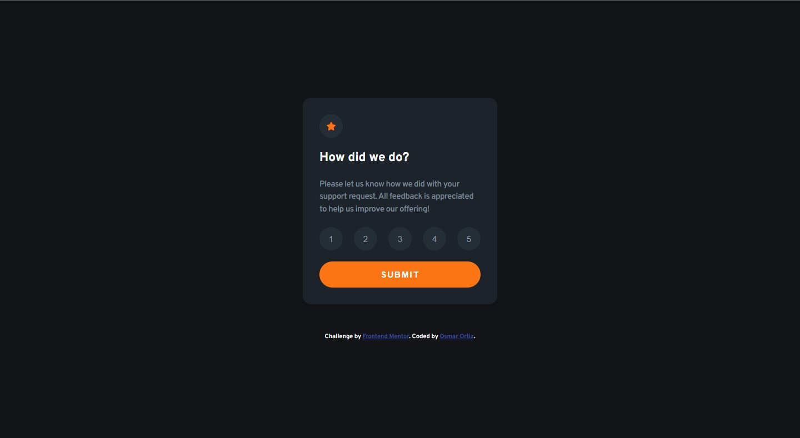
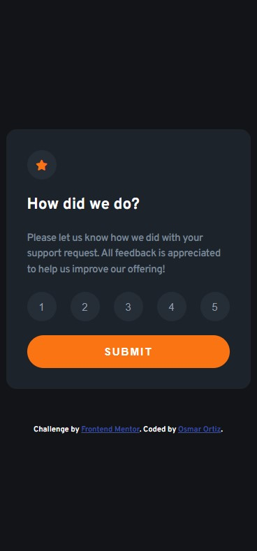
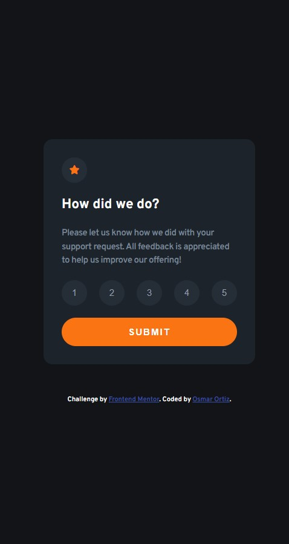
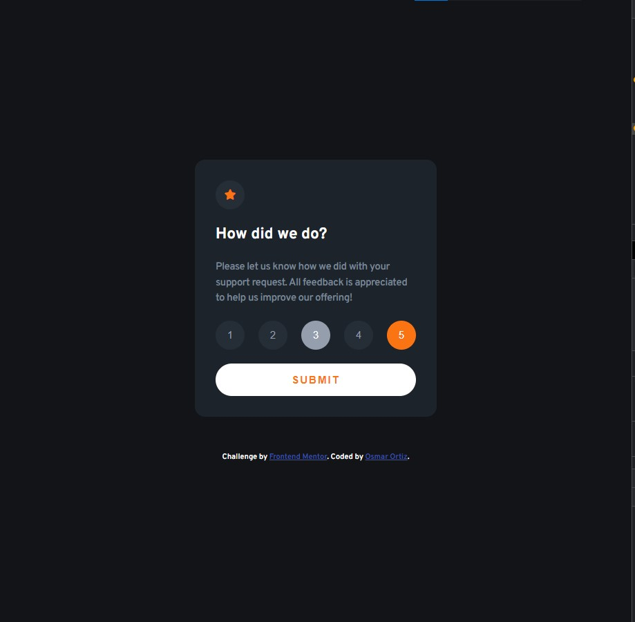

# Frontend Mentor - Order summary card solution

This is a solution to the [Interactive rating component](https://www.frontendmentor.io/challenges/interactive-rating-component-koxpeBUmI). Frontend Mentor challenges help you improve your coding skills by building realistic projects.

## Table of contents

- [Overview](#overview)
  - [The challenge](#the-challenge)
  - [Screenshot](#screenshot)
  - [Links](#links)
- [My process](#my-process)
  - [Built with](#built-with)
  - [What I learned](#what-i-learned)
  - [Continued development](#continued-development)
- [Author](#author)

## Overview

### The challenge

Users should be able to:

- See hover states for interactive elements

### Screenshot

### Links

- Live Site URL: [View in Netlify](https://interactive-rating-component-xizted.netlify.app/)

## My process

### Built with

- CSS custom properties
- Mobile-first workflow
- CSS Flexbox
- Javascript

### What I learned

I learned how to manipulate the dom with javascript

### Continued development

I need to keep practicing with CSS and semantic HTML, as well as naming the CSS classes and optimizing the code.

## Author

- Frontend Mentor - [@Xizted](https://www.frontendmentor.io/profile/Xizted)
- Twitter - [@osmar_ortiz79](https://www.twitter.com/osmar_ortiz79)
